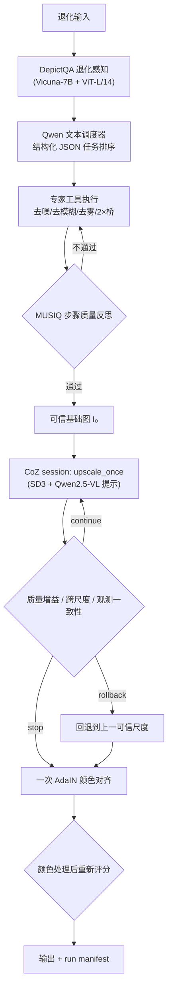

# ScaleGuard-4K

[](https://www.python.org/downloads/)
[](LICENSE)
[](https://github.com/liuqjjin/scaleguard-4k/actions/workflows/ci.yml)

> 面向复杂退化的跨尺度一致性高分辨率恢复智能体

ScaleGuard-4K 研究的问题是：**当生成式超分被递归地叠加时，如何判断放大到哪一步为止仍然可信**。系统在每一次尺度跃迁上显式做出继续、停止或回退的决策，依据是同分辨率质量增益、低通跨尺度一致性，以及在声明了前向成像算子时的观测一致性。每个决策都绑定到确切的输入字节、配置、运行时和产出物。

规范运行时通过锁定版本的适配层调用
[4KAgent](https://github.com/taco-group/4KAgent) 与
[Chain-of-Zoom](https://github.com/bryanswkim/Chain-of-Zoom)：前者负责退化感知与原生尺度恢复，后者负责终端 4× 生成式候选。ScaleGuard 自身拥有尺度状态策略、显存生命周期、证据契约、阈值标定与配对评估。两个上游都不在本仓库中重新实现或再分发。

> **当前证据级别：`STATIC_READY`。** CPU/mock 路径、静态检查、契约与部署入口已就绪。本仓库**不声称**任何 GPU 结果、运行时长、显存数字或研究指标。权威边界记录在 [docs/results/STATUS.md](docs/results/STATUS.md)。

## 一、要解决的问题

在未知复合退化（噪声、模糊、压缩、雾、低光叠加）的图像上做极端超分时，存在两个现实失效模式。

**第一，无参考指标会奖励幻觉。** 递归生成式超分的每一步都可能在提升美学分或无参考质量分的同时，悄悄破坏保真度——编造纹理、改变文字、漂移人脸身份、扭曲结构与颜色。把不同尺寸的两张图直接比较并解释为"质量提升"，在方法上是不成立的。

**第二，上游智能体无法把尺度表示成状态。** 4KAgent 用两个同名的 `super-resolution` 字符串任务表达 16×，而调度、回滚与重规划多处使用 `set()`，重复的超分步骤会被折叠；`run(plan=...)` 路径下失败后的回滚分支根本不会执行。因此不存在可靠的逐尺度接受/停止/回退边界。

ScaleGuard 的答案是把尺度变成一等状态，并为每次跃迁提供一个可以否决它的、确定性的裁决器。

## 二、核心方法

### 2.1 三道门

设 $I_{t-1}$ 为上一可信状态，$I_t$ 为候选，$D(\cdot)$ 为低通加下采样算子，$Q(\cdot)$ 为固定版本的质量评估器。

**同分辨率质量增益。** 把 $I_{t-1}$ 用确定性双三次插值放大到候选尺寸得到基线 $B_t$，只在同一分辨率下比较：

$$\Delta Q_t = Q(I_t) - Q(B_t) \ \ge\ \tau_Q$$

这条门回答的是"生成式超分是否真的比朴素插值更好"，而不是"放大后的图看起来是否更清晰"。低分更优的 PyIQA 指标由适配层统一取反，方向永远是越大越好。

**跨尺度一致性。** 把候选低通滤波并缩回上一可信尺寸，在 RGB 与梯度两个域上分别设阈。RGB 域上是归一化重建误差：

$$E^{\mathrm{rgb}}_{\text{scale}} = \frac{\operatorname{RMSE}(D(I_t),\ I_{t-1})}{\operatorname{RMS}(I_{t-1}) + 10^{-6}}$$

梯度域上是水平与垂直一阶差分的平均绝对分歧：

$$E^{\text{grad}}_{\text{scale}} = \frac{1}{2}\left(\operatorname{mean}\left|\Delta_x D(I_t) - \Delta_x I_{t-1}\right| + \operatorname{mean}\left|\Delta_y D(I_t) - \Delta_y I_{t-1}\right|\right)$$

两者各有独立标定的上界，**不**与质量增益相加。低通半径随缩放比自适应（`radius = max(0.5, ratio/2)`），重采样用 Lanczos。这道门是保真度地板：它检测大范围的结构与颜色漂移，防止高美学分掩盖主体、文字、身份的改变。它**不**证明新增高频细节为真。

**观测一致性。** 当数据生成过程有已知或可估计的前向算子 $H_\theta$ 时，把候选映射回观测空间：

$$E_{\text{meas}} = \frac{\operatorname{RMSE}(H_\theta(I_t),\ I_{\text{obs}})}{\operatorname{RMS}(I_{\text{obs}}) + 10^{-6}}$$

已实现的算子为 Lanczos 重采样、高斯 PSF、JPEG 压缩、Poisson–Gaussian 光子噪声、均匀雾。每个算子都导出规范身份（实现、版本、依赖版本、预处理、完整参数），并写入清单——同一份标定收据不能跨 $\sigma$ 或 JPEG 质量复用。随机算子固定种子。

这些是**简化模型**，用于受控合成实验，不是对未知相机、显微镜或卫星链路的盲估计。没有前向成像实验时，本项目应被描述为低层视觉与生成式超分工程，而不是物理验证过的计算成像。

### 2.2 决策规则

三道门是并列的**门控**而非加权求和——未经标定的指标机械相加会让一个维度的劣化被另一个维度的提升掩盖：

```text
跨尺度误差超限            → rollback（结构漂移，拒绝候选）
观测误差超限（若启用）     → rollback
质量增益不足              → stop（一致但无稳定收益，停在当前尺度）
三门均过且未达目标        → continue
三门均过且已达目标        → stop（接受）
```

质量门只在候选尺度真正超过 bridge 尺度时才要求——2× 保真桥不需要证明自己胜过双三次。

### 2.3 尺度策略

| 目标倍率 | 受控路径 |
| ---: | --- |
| 1× | 仅原生尺度恢复 |
| 2× | 4KAgent 的一次保真 2× 桥 |
| 4× | 一次终端 4× 状态 |
| 8× | 一次 2× 桥 + 一次终端 4× 状态 |
| 16× | 同一 CoZ session 内两次 `upscale_once`，逐次决策 |

倍率是离散的（`bridge_factor × 4^coz_steps`），最多两次 CoZ 步。没有任意目标尺寸优化器，也没有无界递归缩放。生成式超分被固定为**终端阶段**：去噪、去模糊、去雾、去 JPEG 先做完，得到可信基础图之后才允许生成。低风险的 2× 桥是受控例外。

## 三、智能体如何工作

一次完整运行经过四个角色，每个角色的边界都是进程级的。



**感知（VLM）。** DepictQA 作为 4KAgent 的传递依赖，以回环 HTTP 服务运行在独立环境和独立显卡上，输出复合退化的判定。它是视觉语言模型，读图后给出退化描述。

**规划（LLM）。** 任务排序交给 DashScope 上一个日期固定的 Qwen 快照，`temperature=0`、关闭 thinking、强制 `json_object` 响应格式。请求是**纯文本**的：适配层拒绝任何携带图像的调度调用，图像字节不出本机。响应必须是恰好含 `thought` 与 `order` 两个键的 JSON，结构校验失败按预算重试，传输错误与协议错误分别计数。清单里只保留脱敏后的调度证据（provider、region、endpoint 主机的 SHA-256、请求参数、每次尝试的状态码/请求 ID/token 数），原始 prompt 不落盘。

**执行与反思。** 专家工具在只读的上游 runtime view 上运行，工具调用被替换为免 shell 的直接调用。质量反思用锁定权重的 MUSIQ。适配层从 agenda 中过滤掉全部超分任务与人脸、老照片修复——生成式超分被保留给终端阶段，其余超出当前实验范围。这意味着 **LLM 无法自主把任何放大操作排进计划**：2× 桥只能由 ScaleGuard 依据 `bridge_factor` 在 propose/reschedule 之后追加，并由一个一次性标志保证全局至多执行一次。清单里的执行路径会被独立复核，出现被禁任务或桥次数异常即判定契约违约。

**终端生成。** CoZ 以常驻 worker 形式运行，JSON-lines 协议，一次只暴露一个 4× 跃迁。session 内做哈希链：每次 `upscale` 请求携带步索引与种子，worker 校验输入哈希等于当前可信哈希才继续，候选只有在收到 `accept` 后才被提升为可信状态，收到 `rollback` 则丢弃。种子按 `config.coz.seed + step_index - 1` 派生。16× 的两步共享同一 session，避免重复加载 SD3 与 Qwen2.5-VL。

**颜色与复评。** 上游流程的缺陷之一是先算 IQA 再做 AdaIN，颜色处理后的真实输出从未被重新评分。ScaleGuard 把 AdaIN 后的候选、AdaIN 前的候选、上一可信状态、恢复后的基础图依次送回同一套门控，**最终写出的字节就是被评分的字节**。final 记录还绑定源产物的 SHA-256 与变换类型，`achieved_factor` 必须能从 bridge 与已接受步数唯一推导。

**显存生命周期。** RESTORATION、PERCEPTION、COZ、EVALUATION 是互斥相位。两张 24 GB 卡装不下常驻的 4KAgent 感知 VLM、DepictQA 服务与 CoZ 全部模型，所以相位化释放是硬约束而非优化。在线质量门跑在 CPU 上，让 CoZ 独占两张卡；学习型指标只在运行结束后离线评估。

## 四、实验设计

### 4.1 四组配对消融

四组共享同一份输入快照、同一 CoZ 种子、同一质量指标版本，只改变被隔离的那一个因素：

| 组 | 4KAgent | 目标 | CoZ 步 | 接受策略 | 隔离的因素 |
| --- | --- | ---: | ---: | --- | --- |
| A-only | upstream | 1× | 0 | fixed | 退化感知恢复本身的贡献 |
| B-only | identity | 4× | 1 | fixed | 不做恢复直接生成的代价 |
| AB-fixed | upstream | 4× | 1 | fixed | 固定链路的收益 |
| ScaleGuard | upstream | 4× | 1 | trusted | 门控相对固定链路的净效果 |

A-only 是原生分辨率的恢复基线，它的输出**不会**被偷偷放大去凑 4× 的配对——该组在 4× 目标下的全参考指标标记为不适用。任何组缺失都不允许用其他组的输出顶替或插补指标。

编排器要求 Git HEAD 干净且固定，为每个作业生成新的运行时 preflight，逐作业记录 argv、返回码、执行前后的提交、清单与产物清单哈希。作业失败会被保留但不中断后续作业。套件结束时重新验证每一份清单，并强制同一样本内输入证据、质量配置、项目提交、运行时执行绑定、环境安装身份与权重身份完全一致。

### 4.2 阈值标定

阈值不能在评估集上调。标定流程：人工对每个带指标的尺度步打 `acceptable` 标签 → 只用非 mock 的可接受样本 → 以**输入图像 SHA-256 聚类**为重采样单元（不是单个递归步，也不是重复种子）→ 质量取 0.05 下分位、误差取 0.95 上分位 → 2000 次 bootstrap、95% 区间、种子 20250727 → 默认要求至少 20 个可接受聚类，不足则写 `insufficient_data` 并非零退出。

验证器不接受自哈希：它重新打开记录的标签与清单，从那些确切字节重跑标定，比对重建出的收据，并检查评估器身份、权重身份、前向模型完整参数、聚类 bootstrap 设置、区间与阈值的精确相等。控制器在构造时重复这次验证，把收据路径、大小、SHA-256 与语义结果写进清单。

需要说明标定的边界：最小聚类数、分位与 bootstrap 设置都取自收据自身声明的参数，验证保证的是"这份收据与它声明的参数和源数据自洽"，而不是"这些参数本身足够"。bootstrap 区间被记录但其宽度不参与门控。分位标定定义的是"可接受样本包络"，它不证明最优分类、因果性或人类偏好的泛化。因此报告必须附带对分位、最小样本数、种子、数据集与标注者一致性的敏感性分析。

### 4.3 指标

- **全参考**（有对齐参考时）：PSNR、SSIM、LPIPS
- **无参考**：MUSIQ、CLIPIQA
- **控制器**：质量增益、scale NRMSE、scale edge MAE、可选 measurement NRMSE
- **决策**：接受率、停止率、回退率、失败率
- **系统**：成功率、墙钟时间、CoZ 初始化 vs 首步 vs 稳态步耗时、worker 分配器峰值、每张 preflight 绑定物理卡的主机级采样显存与利用率

主机级 GPU 采样不做进程归因，不得当作某个组件的分配器峰值来汇报。

签入的两份运行时配置都**没有**绑定标定收据，其中的阈值（`min_quality_gain: 0.0`、`max_scale_nrmse: 0.12`、`max_scale_edge_mae: 0.10`）是未标定的操作性默认值。用它们运行会在清单里留下 `quality_thresholds_uncalibrated`，这样的运行可以用于组件复现，但不足以支撑控制器有效性的研究结论。研究用途需要另建一份配置，把标定得到的阈值精确写入并指向对应收据。

## 五、CPU 可验证的快速开始

需要 Python 3.10–3.14 与 [uv](https://docs.astral.sh/uv/)。CI 与运行时引导使用 uv 0.11.16，记录在 [`environments/uv.version`](environments/uv.version)。

```bash
uv sync --locked --extra dev
bash scripts/run_cpu_demo.sh
```

演示生成一个确定性的 192×128 fixture，校验签入的 CPU 配置，运行公开 CLI，验证生成的清单，核对最终产物哈希与 mock 标记。每次调用获得系统临时目录下的独立路径，不向仓库写入任何运行或输出。

mock 路径走通编排并产生真实文件与溯源，但不加载任何上游模型。所有派生产物标记 `mock: true`；它支撑契约、演示与 CI，**不支撑**任何图像质量或运行时结论。

运行时 YAML 是严格的，不做环境变量插值。字段、路径解析规则与观测模型参数见[配置参考](docs/configuration.md)。

完整开发检查：

```bash
uv run --locked ruff check .
uv run --locked ruff format --check .
uv run --locked mypy src/scaleguard
uv run --locked python -I -m pytest --cov=scaleguard --cov-report=term-missing -q
```

## 六、真实运行时

真实路径面向 Linux x86_64（glibc ≥ 2.28）与同主机两张 24 GiB RTX 4090。ScaleGuard、4KAgent、CoZ 与 4KAgent 传递依赖的 DepictQA 保持四个隔离环境；DepictQA 不是第三个核心项目。不要合并它们的 PyTorch 与 Transformers 栈。

```bash
scripts/autodl/bootstrap.sh
scripts/autodl/download_weights.sh
scripts/autodl/run_smoke.sh \
  --config configs/runtime/autodl-2x4090.yaml \
  --input /path/to/authorized-smoke-image.png
```

外部门槛：Stable Diffusion 3 Medium 的 Hugging Face 仓库是 gated 的，需要本人接受许可并私下认证；北京区域的 DashScope 凭据；上游 DepictQA 退化 delta（发布方不提供摘要）；获授权的图像。Qwen 及若干指标/模型依赖的条款比本仓库的 Apache-2.0 更严格。

上述命令都未被提升为项目结果。下载权重或发布输出前请阅读[安装](docs/installation.md)、[AutoDL 指南](docs/autodl.md)、[外部门槛请求](external_gate/REQUEST.md)与 [NOTICE](NOTICE)。

## 七、证据规则

运行清单保存配置、种子、图像哈希、决策、提示配置标识、脱敏的调度请求元数据、进程命令、stdout/stderr 路径与可得的显存证据。原始远程调度 prompt 与图像字节不被序列化。完成级别的含义是严格的：

- `STATIC_READY`：CPU 测试与契约通过
- `COMPONENT_REPRODUCED`：两个上游各自以真实模型独立运行过
- `AB_INTEGRATED`：真实 4KAgent → CoZ 集成通过
- `SCALEGUARD_VALIDATED`：真实多尺度接受/停止/回退通过
- `RESEARCH_EVALUATED`：配对实验与消融完成

只能报告有留存产物支撑的最高级别。当前是 `STATIC_READY`，见[证据状态](docs/results/STATUS.md)。打标签发布前请走[发布检查表](docs/release-checklist.md)。

诚实的边界也是结果的一部分：[限制说明](docs/limitations.md)记录了跨尺度检查的低层性质、观测算子的简化程度、生成幻觉的不可消除性，以及显存仍随图像面积增长的事实。

## 八、仓库结构

```text
src/scaleguard/           控制器、契约、指标、适配层、CLI
  controller/             尺度状态机与倍率策略
  metrics/                质量增益与跨尺度一致性
  imaging/                前向退化算子
  evaluation/             标定、指标收据、配对汇总
  runtime/                进程、显存生命周期、服务管理
third_party/overlays/     针对锁定 checkout 的小型适配层
third_party/patches/      可审计的上游修正
configs/                  运行时与实验协议
scripts/run_cpu_demo.sh   隔离的公开 CPU/mock 演示
scripts/autodl/           双 4090 部署与诊断收集
tests/                    单元、契约、集成与评估测试
docs/                     架构、复现、许可与结果
docs/adr/                 12 份架构决策记录
```

上游仓库与权重被取到 ignore 路径。它们的提交、树哈希、补丁、模型修订与已知 blob 记录在 `upstream-lock.yaml` 与 `weights-lock.json`。

## 九、许可

ScaleGuard-4K 的原创代码采用 Apache-2.0。上游代码、模型权重、数据与可选指标保留各自的许可。本包不分发任何上游 checkout 或模型权重。
