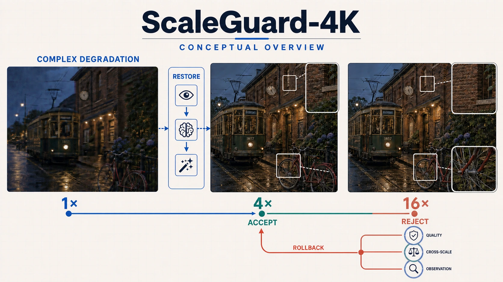
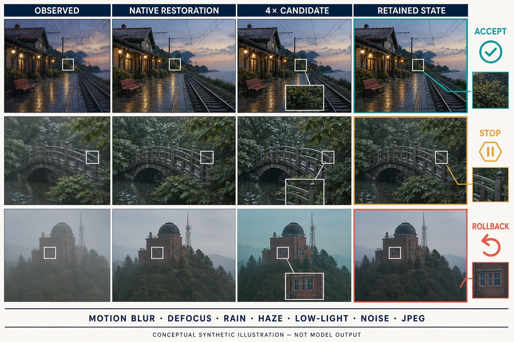
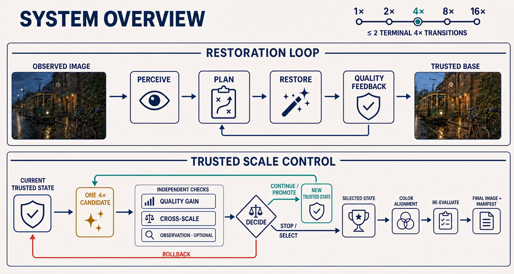
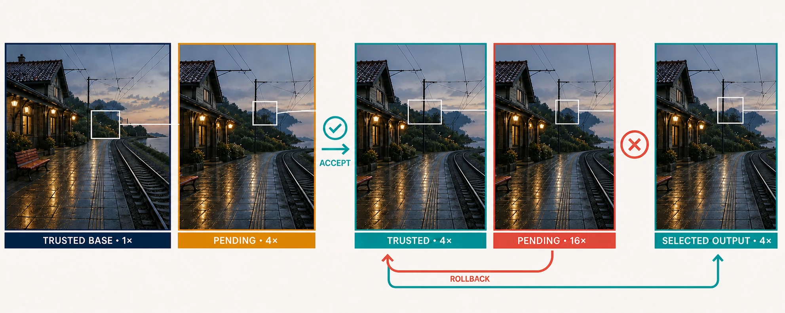
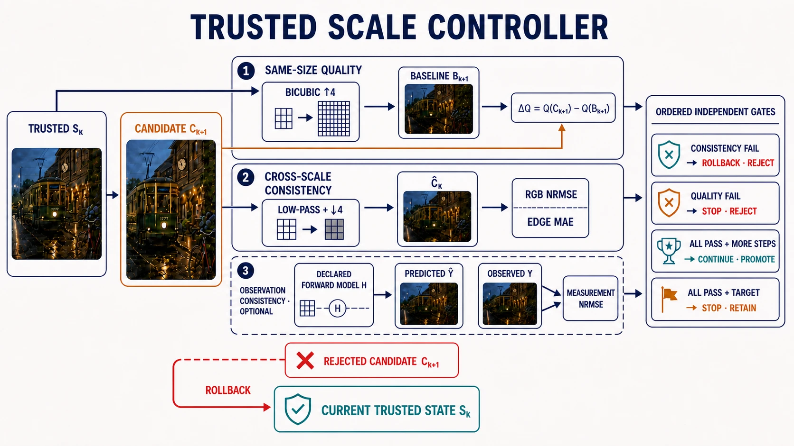

<div align="center">

# ScaleGuard-4K

**面向复杂退化的跨尺度一致性高分辨率恢复智能体**

[](https://www.python.org/downloads/)
[](LICENSE)
[](https://github.com/liuqjjin/scaleguard-4k/actions/workflows/ci.yml)

ScaleGuard-4K 用于处理同时包含模糊、噪声、压缩伪影、雾和低照度等退化的图像。系统先分析并处理退化，再逐步生成更高分辨率的结果；每次生成新的 4× 候选后，控制器都会检查画质增益、结构与边缘变化，以及可选的观测误差，决定采用新结果、停在当前尺度，还是退回上一步。

</div>

<p align="center">
  
</p>

## 为什么需要尺度控制

输入同时带有模糊、噪声或压缩伪影时，直接超分会把已有缺陷带入纹理生成；低照度和雾还会影响颜色与对比度。因此，系统先判断退化，再选择相应的恢复步骤。

生成式超分可以补出清晰纹理，也可能改动文字、边缘、颜色和局部结构。倍率继续增大时，前一步产生的偏差会成为下一步的输入。固定执行两次 4× 只能得到一条不可中断的 16× 路径，无法判断第一步的结果是否值得继续放大。

ScaleGuard-4K 为每次生成结果保留独立状态。候选通过检查后才会进入下一步；画质增益不足时停在当前尺度，结构变化过大时退回上一结果。

<p align="center">
  
</p>

## 方法

<p align="center">
  
</p>

### 退化感知与恢复

输入图像先经过退化感知，规划器再从已注册的恢复工具中生成执行顺序。每个步骤完成后都会重新评估图像；如果恢复效果没有达到要求，系统可以调整后续计划。放大操作不进入恢复计划，而是在恢复结束后由尺度控制器统一管理。

这条流程把 VLM 退化感知、结构化任务规划、专家工具调用和质量反馈组织成一个有状态 Agent。规划器只输出受约束的任务序列；恢复工具受白名单约束，父进程再核对终端放大任务和 2× 补充步骤的数量与位置。

### 尺度状态

系统支持 1×、2×、4×、8× 和 16× 五种目标倍率。一次生成式超分产生一个 4× 候选；16× 由同一会话中的两次候选生成完成，中间必须经过一次明确判断。2× 与 8× 使用一次受控的 2× 补充步骤。

控制器有三种动作：

- `continue`：接受候选，并继续生成下一尺度；
- `stop`：结束生成；达到目标时保留候选，增益不足时保留上一可信状态；
- `rollback`：一致性超限或执行失败，拒绝候选并退回上一可信状态。

被拒绝的候选不会成为下一步的输入。生成会话保存当前可信状态及候选的哈希，只有收到接受指令后才提交新状态。

<p align="center">
  
</p>

### 候选检查

<p align="center">
  
</p>

控制器分别检查三项信息，而不是把它们加权成一个总分。

**同尺寸画质增益。** 将上一可信状态插值到候选尺寸作为基线，只比较相同分辨率下的质量差异：

$$\Delta Q = Q(\text{候选}) - Q(\text{插值基线})$$

**跨尺度一致性。** 将候选低通并缩回上一尺寸，分别计算 RGB 归一化重建误差和梯度差异，用来发现颜色、整体结构与边缘的漂移。

**观测一致性。** 当实验给出前向退化模型时，将候选映射回观测空间并与输入比较。项目实现了重采样、高斯 PSF、JPEG、Poisson–Gaussian 噪声和均匀雾五类前向模型。

跨尺度或观测误差超限时回退，画质增益不足时停止，三项检查通过后接受候选。各项使用独立阈值，避免某一指标的提升掩盖另一个维度的明显劣化。阈值配置、滤波参数与前向模型定义见 [架构文档](docs/architecture.md) 和 [配置文档](docs/configuration.md)。

## 实验设计

| 组别 | 恢复 | 生成式超分 | 尺度决策 |
| --- | --- | --- | --- |
| A-only | 是 | 否 | — |
| B-only | 否 | 是 | 固定接受 |
| AB-fixed | 是 | 是 | 固定接受 |
| ScaleGuard | 是 | 是 | 质量与一致性检查 |

AB-fixed 与 ScaleGuard 用于比较固定放大和尺度控制；A-only、B-only 分别观察恢复阶段与生成阶段的作用。各组使用相同的输入快照、模型版本、生成种子和指标配置。最终报告 PSNR、SSIM、LPIPS、MUSIQ、CLIPIQA、跨尺度误差，以及停止和回退比例；统计以输入图像为重采样单元给出 95% bootstrap 区间。

当前配对协议只覆盖单次 4×。系统支持逐样本运行到 16×，但两步配对消融需要另建协议后单独报告。完整协议见 [实验与评估文档](docs/evaluation-protocol.md)。

### GPU 实验目标

下表是正式实验前设定的预期区间，后续以同一配对协议下的 GPU 实测结果替换。

| 指标 | 预期区间 |
| --- | ---: |
| 人工复核的不一致尺度推进率 | 由 20%–25% 降至 6%–10% |
| 误回退率 | 不高于 15% |
| 4× 候选接受率 | 75%–90% |
| 停止与回退比例 | 10%–25% |
| 已接受 4× 输出的 PSNR 差值 | ScaleGuard − AB-fixed ≥ −0.1 dB |
| 已接受 4× 输出的 SSIM 差值 | ScaleGuard − AB-fixed ≥ −0.002 |
| 已接受 4× 输出的 LPIPS 差值 | ScaleGuard − AB-fixed ≤ +0.005 |
| 已接受 4× 输出的 MUSIQ 差值 | ScaleGuard − AB-fixed ≥ −0.5 |
| 已接受 4× 输出的 CLIPIQA 差值 | ScaleGuard − AB-fixed ≥ −0.005 |
| 16× 第二步候选拒绝率 | 15%–30% |

这些区间用于检验尺度控制能否拦下不一致候选，同时让已接受结果的画质保持在固定链路附近。不一致推进与误回退由逐候选人工标注统计；全参考指标只统计尺寸与配准关系可比较的输出。停止和回退样本单独报告，不做插值或结果填补。

## 快速开始

需要 Python 3.10–3.14 与 [uv](https://docs.astral.sh/uv/)。

```bash
uv sync --locked --extra dev
bash scripts/run_cpu_demo.sh
```

该命令使用 mock 后端检查 CLI、状态流转、运行清单和产物哈希。真实模型安装与双 GPU 部署见 [安装文档](docs/installation.md) 和 [部署文档](docs/autodl.md)。

## 文档

| 主题 | 位置 |
| --- | --- |
| 架构与设计决策 | [docs/architecture.md](docs/architecture.md)、[docs/adr](docs/adr) |
| 配置字段 | [docs/configuration.md](docs/configuration.md) |
| 实验协议与标定 | [docs/evaluation-protocol.md](docs/evaluation-protocol.md) |
| 复现步骤 | [docs/reproduction.md](docs/reproduction.md) |
| 已知限制 | [docs/limitations.md](docs/limitations.md) |
| 安全与隐私 | [SECURITY.md](SECURITY.md) |

## 限制

跨尺度检查可以发现大范围的颜色、结构与边缘漂移，但不能保证文字、人脸身份或语义正确。前向模型用于受控实验，不负责估计未知采集链路。生成式超分仍可能合成观测中不存在的细节，因此项目同时保留失败样本、停止结果和回退结果，避免只汇报成功输出。更多边界见 [限制说明](docs/limitations.md)。

## 许可

本项目原创代码采用 Apache-2.0 许可。运行时模型与部分指标实现有各自的许可条款，其中包含非商业限制，详见 [NOTICE](NOTICE)。本仓库不分发模型权重。

## 引用与致谢

感谢以下研究工作公开论文与代码：

[4KAgent](https://github.com/taco-group/4KAgent)（[论文](https://proceedings.neurips.cc/paper_files/paper/2025/hash/f0075fe4e59652cf43148dcfab8d3c93-Abstract-Conference.html)）：

```bibtex
@inproceedings{zuo2025fourkagent,
  title     = {4KAgent: Agentic Any Image to 4K Super-Resolution},
  author    = {Zuo, Yushen and Zheng, Qi and Wu, Mingyang and Jiang, Xinrui and
               Li, Renjie and Wang, Jian and Zhang, Yide and Mai, Gengchen and
               Wang, Lihong V. and Zou, James and Wang, Xiaoyu and
               Yang, Ming-Hsuan and Tu, Zhengzhong},
  booktitle = {Advances in Neural Information Processing Systems},
  year      = {2025}
}
```

[Chain-of-Zoom](https://github.com/bryanswkim/Chain-of-Zoom)（[论文](https://proceedings.neurips.cc/paper_files/paper/2025/hash/b66d8cbb01ac8212830068f3d75b4c5c-Abstract-Conference.html)）：

```bibtex
@inproceedings{kim2025chainofzoom,
  title     = {Chain-of-Zoom: Extreme Super-Resolution via Scale Autoregression
               and Preference Alignment},
  author    = {Kim, Bryan Sangwoo and Kim, Jeongsol and Ye, Jong Chul},
  booktitle = {Advances in Neural Information Processing Systems},
  year      = {2025}
}
```

相关代码与权重遵循各自的原始许可。
