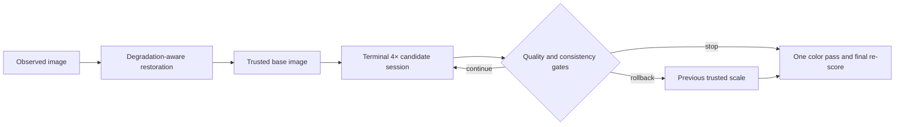

# ScaleGuard-4K

[](https://www.python.org/downloads/)
[](LICENSE)
[](https://github.com/liuqjjin/scaleguard-4k/actions/workflows/ci.yml)

> **Trusted scale control for degradation-aware high-resolution image restoration**

ScaleGuard-4K is a research-engineering framework for deciding how far an image
restoration result can be trusted to scale. Its deterministic controller promotes,
stops, or rolls back each 1×–16× scale transition using same-resolution quality
gain, low-pass cross-scale consistency, and an optional recorded forward imaging
model. Every decision is bound to the exact input, configuration, runtime, and
generated artifact.

The canonical runtime uses locked adapters for
[4KAgent](https://github.com/taco-group/4KAgent) and
[Chain-of-Zoom](https://github.com/bryanswkim/Chain-of-Zoom). They provide the
restoration and terminal 4× candidate generators; ScaleGuard owns the scale-state
policy, lifecycle, evidence contracts, calibration, and paired evaluation. Neither
upstream implementation is redistributed or reimplemented here.

> **Current evidence level: `STATIC_READY`.** The locked CPU/mock path, static
> checks, contracts, and deployment entry points are ready. No ScaleGuard GPU
> result, runtime, VRAM figure, or research metric is claimed. The authoritative
> boundary and unsupported levels are recorded in
> [docs/results/STATUS.md](docs/results/STATUS.md).

## Why the scale state is explicit



CoZ is not registered as a normal 4KAgent tool. The upstream tool contract hides
logs, accepts only one GPU id, can reorder SR among restoration tasks, and cannot
represent two equal-named 4× states without losing multiplicity. ScaleGuard
therefore keeps 4KAgent as the only degradation planner and gives terminal scale
recursion its own short-lived process/session contract.

## CPU-verifiable quick start

Python 3.10 or newer and [uv](https://docs.astral.sh/uv/) are required. CI and
the runtime bootstrap use uv 0.11.16, recorded in
[`environments/uv.version`](environments/uv.version).

```bash
uv sync --locked --extra dev
bash scripts/run_cpu_demo.sh
```

The demo uses only `uv run --locked`. It generates a deterministic 192×128
fixture, validates the checked-in CPU config, runs the public CLI, validates
the resulting manifest, and verifies the final artifact hash and mock labels.
Every invocation receives a unique directory below the system temporary
directory; the script prints that path and leaves it available for inspection
without writing a run or output into the repository.

The mock path exercises orchestration and produces real files and provenance,
but it does not load either upstream model. Every derived artifact is marked
`mock: true`; it supports contracts, demonstrations, and CI, never
image-quality or runtime claims.

Runtime YAML is strict and does not interpolate environment variables. See the
[annotated configuration reference](docs/configuration.md) for every field,
path-resolution rules, and observation-model parameters.

For the complete development checks:

```bash
uv run --locked ruff check .
uv run --locked ruff format --check .
uv run --locked mypy src/scaleguard
uv run --locked python -I -m pytest --cov=scaleguard --cov-report=term-missing -q
```

## Real runtime

The real path is prepared for Linux x86_64 (glibc 2.28 or newer) with two
24 GiB RTX 4090-class GPUs. It keeps ScaleGuard, 4KAgent, CoZ, and 4KAgent's
transitive DepictQA service in four isolated environments; DepictQA is not a
third core project. Do not merge their PyTorch and Transformers stacks.

On the target machine, after reviewing the installation and AutoDL guides:

```bash
scripts/autodl/bootstrap.sh
scripts/autodl/download_weights.sh
scripts/autodl/run_smoke.sh \
  --config configs/runtime/autodl-2x4090.yaml \
  --input /path/to/authorized-smoke-image.png
```

CoZ uses Stable Diffusion 3 Medium, whose Hugging Face repository is gated.
The user must accept its license and authenticate privately before the pinned
snapshot can be downloaded. A 4KAgent scheduler API credential, the upstream
DepictQA delta, authorized images, and a suitable host are also external gates.
The Qwen model and several metric/model dependencies carry terms more
restrictive than this repository's Apache-2.0 license.

No real command above has been promoted to a project result. Read
[installation](docs/installation.md), [the AutoDL guide](docs/autodl.md),
[the external-gate request](external_gate/REQUEST.md), and [NOTICE](NOTICE)
before downloading weights or publishing outputs.

## Scale policy

| Requested factor | Controlled path |
| ---: | --- |
| 1× | restoration only |
| 2× | one fidelity-preserving 2× bridge |
| 4× | one terminal 4× state |
| 8× | one 2× bridge, then one terminal 4× state |
| 16× | two `upscale_once` calls in the same CoZ session |

The controller compares every CoZ candidate with a bicubic baseline at the same
pixel dimensions. Cross-scale comparison first low-pass filters and downsamples
the candidate. If a known observation operator is configured, its reconstruction
error is gated separately; uncalibrated metrics are never summed into a single
opaque score.

The bundled `gradient_proxy` exists only to exercise CPU control flow. Real-runtime
configs use a versioned PyIQA metric, and thresholds still require a held-out
validation split. See [the evaluation protocol](docs/evaluation-protocol.md) and
the ADRs in [docs/adr](docs/adr).

## Repository map

```text
src/scaleguard/           controller, contracts, metrics, adapters, CLI
third_party/overlays/     small adapters imported against pinned checkouts
third_party/patches/      auditable upstream fixes
configs/                  runtime and experiment protocols
scripts/run_cpu_demo.sh   isolated public CPU/mock demonstration
scripts/autodl/           two-4090 deployment and diagnostic collection
tests/                    CPU unit, contract, integration, and evaluation tests
docs/                     architecture, reproduction, licensing, and results
```

Upstream repositories and weights are fetched into ignored paths. Their commits,
tree hashes, patches, model revisions, and known blobs are recorded in
`upstream-lock.yaml` and `weights-lock.json`.

## Evidence rules

Run manifests preserve the config, seeds, image hashes, decisions, prompts,
process commands, stderr/stdout paths, and available GPU-memory evidence. The
published completion labels have strict meanings:

- `STATIC_READY`: CPU tests and contracts pass.
- `COMPONENT_REPRODUCED`: both upstreams ran independently with real models.
- `AB_INTEGRATED`: real 4KAgent → CoZ integration passed.
- `SCALEGUARD_VALIDATED`: real multi-scale accept/stop/rollback passed.
- `RESEARCH_EVALUATED`: paired experiments and ablations are complete.

Only the highest level backed by retained artifacts may be reported.
The current level is `STATIC_READY`; see
[the evidence status](docs/results/STATUS.md). Before tagging a release, follow
[the release checklist](docs/release-checklist.md).

## License

ScaleGuard-4K's original code is Apache-2.0. Upstream code, model weights, data,
and optional metrics remain under their own licenses. No upstream checkout or
model weight is distributed as part of this package.
