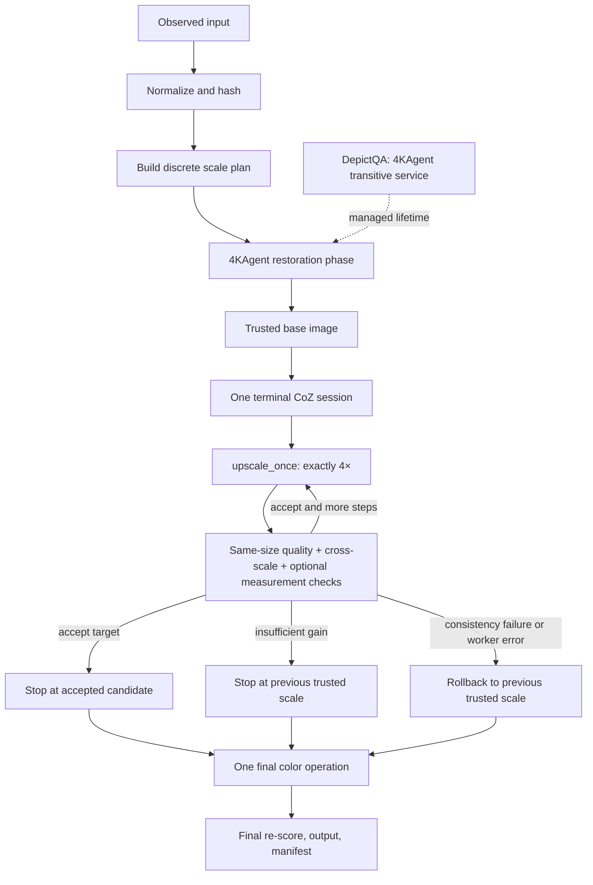

# Architecture

ScaleGuard-4K is a deterministic engineering and evaluation layer around two
algorithmic upstreams:

1. **4KAgent** performs degradation perception, native-scale restoration,
   reflection, and non-SR rollback.
2. **Chain-of-Zoom (CoZ)** is the only terminal generative super-resolution
   method and exposes one 4× transition at a time.

There is no third runtime agent, restoration method, SR method, or VLM project.
DepictQA is a transitive perception service already required by the selected
4KAgent path. It is declared separately in `runtime-dependencies.yaml` so its
source identity and lifetime are explicit; it is not a third core project.
AgenticIR remains citation and lineage context only.

The current public evidence level is `STATIC_READY`. This document describes
implemented contracts and intended real-runtime boundaries, not a completed GPU
reproduction.

## Control and data flow



ScaleGuard is not another reasoning agent. Its Trusted Scale Controller is a
small state machine with three actions: `continue`, `stop`, and `rollback`.
It does not select restoration tools, generate prompts, or replace either
upstream model.

## One outer restoration pass, one terminal SR phase

The 4KAgent adapter imports the pinned checkout and filters generated
`super-resolution*` agenda entries before execution. It preserves 4KAgent's
perception, native-resolution restoration, tool selection, reflection,
rollback, and rescheduling. For a requested 2× or 8× result, it may append at
most one existing 2× fidelity bridge.

After 4KAgent finishes, ScaleGuard enters one terminal CoZ phase. A 16× target
uses two `upscale_once` requests in the same CoZ session, with an explicit
decision between them. It is not represented as two equal-named 4KAgent tasks
and CoZ is never shuffled ahead of degradation restoration.

The discrete factor policy is:

| Requested factor | 4KAgent bridge | CoZ transitions | Realized path |
| ---: | ---: | ---: | --- |
| 1× | 1× | 0 | restoration only |
| 2× | 2× | 0 | one fidelity bridge |
| 4× | 1× | 1 | one terminal 4× state |
| 8× | 2× | 1 | one 2× bridge, then one terminal 4× state |
| 16× | 1× | 2 | two controlled 4× states in one session |

`max_coz_steps` is capped at two. Arbitrary factors and unbounded recursive
zoom are intentionally outside the current contract.

## CoZ session boundary

The real runtime uses a separate CoZ environment and a JSON-lines worker
protocol. Persistent mode:

- loads SD3, Qwen, and CoZ adapters once;
- emits a readiness message and answers a health check;
- accepts one `upscale` request only when no candidate is pending;
- checks that the next input hash equals the session's trusted hash;
- promotes a candidate only after `accept`;
- discards the pending candidate after `rollback`; and
- handles `close`, timeout, protocol mismatch, and process-group termination.

Every request carries an explicit step index and seed. The trusted image that
enters the terminal CoZ phase remains the VLM semantic anchor across accepted
scales. One-shot mode uses the same one-step worker implementation but reloads
the models for isolation and recovery.

Two small, ordered CoZ patches are content-hashed in `upstream-lock.yaml`. They
repair the one-step full-image contract and stream Gaussian tile accumulation.
They do not introduce another SR implementation. See
[ADR 0002](adr/0002-one-step-4x-session-and-patch-overlay.md) and the
[upstream audit](upstream-audit.md).

## Trusted-scale decisions

For every CoZ candidate, ScaleGuard first creates a deterministic bicubic
baseline from the previous trusted image at the candidate's pixel dimensions.
Quality gain is therefore a same-resolution comparison:

```text
quality_gain = Q(candidate) - Q(bicubic(previous_trusted))
```

The evaluator normalizes metric direction so larger is better. The bundled
gradient score is a CPU contract proxy only. A PyIQA backend is available for
real experiments, but its thresholds are not trusted until a matching
calibration receipt exists.

Cross-scale checks low-pass and resize the candidate back to the previous
trusted dimensions, then record:

- normalized RGB reconstruction error (`scale_nrmse`); and
- gradient disagreement (`scale_edge_mae`).

When an observation model is enabled, ScaleGuard also maps the candidate into
observation space and records `measurement_nrmse`. Implemented, explicitly
configured forward models are resize, Gaussian-PSF plus resize, JPEG plus
resize, Poisson–Gaussian plus resize, and uniform haze plus resize. These are
controlled experimental operators, not estimated camera physics. The manifest
requires both the finite measurement and the factory-derived canonical model
identity exactly when this gate is enabled; it requires both to be absent when
the gate is disabled.

The decision order is deliberately not an opaque weighted sum:

1. excessive cross-scale error → `rollback`, candidate rejected;
2. excessive measurement error → `rollback`, candidate rejected;
3. insufficient same-size quality gain → `stop`, candidate rejected;
4. all gates pass at the requested scale → `stop`, candidate accepted;
5. all gates pass with another planned step → `continue`, candidate accepted.

A worker or session failure also returns to a previously trusted boundary. If
the whole CoZ session cannot start or close cleanly, ScaleGuard returns to the
pre-session restored state.

After scale selection, ScaleGuard applies at most one configured color
operation. It then computes final metrics from the actual post-color bytes.

## Process and GPU ownership

ScaleGuard keeps the core, 4KAgent, DepictQA, and CoZ environments separate.
External commands are argument vectors, not shell strings. `ProcessRunner`
phases retain redacted arguments, working directory, exit code, duration,
stdout, stderr, and sampled GPU memory when `nvidia-smi` is available.
Persistent CoZ instead retains its protocol log, stderr, worker-reported device
inventory, and PyTorch peak-allocation metadata. Its JSONL `ready` response
records `initialization_duration_seconds` from immediately before session
construction until the models are ready. The adapter validates that value as a
finite non-negative duration and binds it only into the first persistent scale
step's worker metadata. Each step keeps its separate worker-reported
`duration_seconds`, so later GPU evaluation can distinguish initialization from
step execution without counting the load time again. These are instrumentation
fields, not measured performance claims.

Each external leader owns a fresh POSIX session. A short post-leader grace
permits ordinary shutdown; any remaining group members are terminated with
bounded TERM/KILL escalation before control returns. CoZ protocol reads have a
single absolute deadline and a 1 MiB response ceiling, including the
partial-line case. Deliberate `setsid` escape is outside this ownership model
and is forbidden for configured workers.

The GPU lifecycle ledger prevents overlapping heavyweight phases within the
controller and records acquire/release intent:

- 4KAgent restoration uses its configured tool GPU;
- the managed DepictQA service is started only for the 4KAgent phase and is
  always stopped by its context manager;
- CoZ receives its configured visible-device set in a separate process; and
- the controller's online PyIQA gate runs on CPU so it cannot retain CUDA
  allocations while the persistent CoZ process owns both GPUs; and
- phase exit does not by itself prove that a framework released every byte of
  device memory.

Production `upstream` mode requires a managed DepictQA launch command. A
pre-existing TCP endpoint cannot prove ownership or shutdown, so it is not
accepted for the two-GPU path.

Actual device placement, peak VRAM, and cleanup effectiveness remain GPU
measurements. Static phase events are not substitutes for those measurements.

## Artifacts and evidence

Every run gets a new directory containing normalized input, state images,
worker-private files, logs, metric baselines, final output, and an atomically
updated `manifest.json`. Image artifacts record hashes, dimensions, media type,
stage, and mock status. Scale-step records preserve:

- trusted and candidate artifacts;
- input and candidate scale;
- metrics, decision, acceptance, and reason;
- timestamps, worker metadata, and process evidence; and
- failures or rollback state.

Mock workers write real PNGs and exercise the same controller, but all derived
artifacts remain `mock: true`. A manifest's completion label is run-level
metadata, not sufficient project-wide evidence by itself. Project status is
raised only after the required raw artifacts and wrapper checks are reviewed;
see [results status](results/STATUS.md).

## Trust boundaries

- Source checkouts, commits, trees, and ordered patches are verified against
  `upstream-lock.yaml`.
- Every real attempt re-audits all four current runtime environments and binds
  their complete distribution maps and offline import probes to a fresh
  schema-v2 preflight receipt before model execution.
- Bootstrap itself is reconstructed from a committed uv wheel/executable
  identity and a committed Python archive identity, and reinstalls locked
  package bytes. See
  [ADR 0009](adr/0009-bind-runtime-bytes-at-each-real-attempt.md).
- Model downloads and manual gates are recorded through `weights-lock.json`;
  a locally measured digest does not authenticate a publisher that supplied no
  digest.
- Calibration receipts bind labels, manifests, artifact hashes, metric
  identity, thresholds, bootstrap settings, and sample counts. Controller
  construction and paired-summary review independently verify the exact
  receipt path, bytes, and semantics; see
  [ADR 0011](adr/0011-bind-calibration-and-conditional-observation-evidence.md).
- The remote planner is a text-only, provider-bound DashScope request with a
  dated Qwen snapshot, finite transport/structure budgets, and request metadata
  receipts; see [ADR 0012](adr/0012-bind-the-remote-scheduler-to-dashscope.md).
- No token, API key, weight, upstream checkout, or private dataset belongs in
  Git.

Accepted architecture decisions are recorded in
[docs/adr](adr/). Licensing and source-level caveats are in
[NOTICE](../NOTICE) and the [upstream audit](upstream-audit.md).
